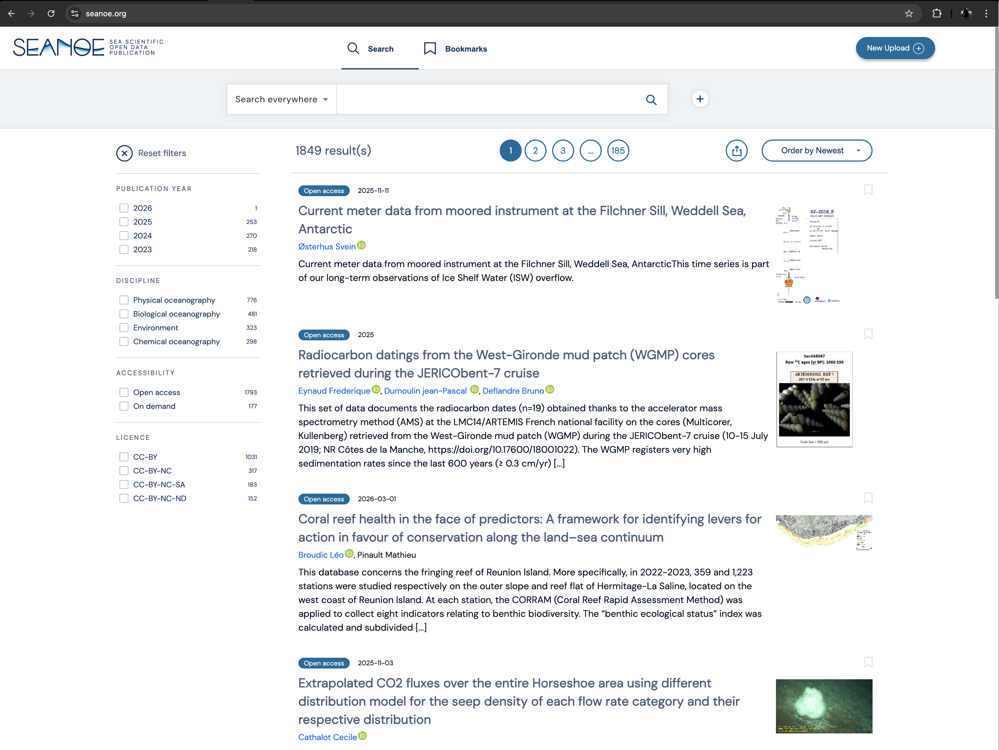

# SEANOE

SEANOE (SEA scieNtific Open data Edition) is an open scientific data repository in the marine sciences field. Currently operated by the SISMER marine data center within the ODATIS Ocean Cluster framework and funded by Ifremer.

Publication of datasets in SEANOE data is free of charge, with a limitation of 100GB of size per record.

Each dataset published on SEANOE will get a unique DOI which allow it to be published and cited in the most reliable and sustainable way.

Seanoe is accessible at the url : [seanoe.org](https://seanoe.org)

It primarily show the latest outputs.

Follow [this tutorial](../tutorials/upload-seanoe.md) to upload your own data to Seanoé