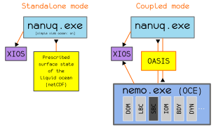

# NANUQ

NANUQ is a fork of SI3+SBC, namely the sea-ice + ocean surface boundary conditions components of NEMO version 5.

You can find code on this [github page](https://github.com/nanuqhub/nanuq/).

Put simply, NANUQ is a standalone executable that computes the surface fluxes expected by the 3D liquid ocean as surface boundary conditions (momentum, heat & mass), in the presence of sea-ice or not. As part of this, it resolves sea-ice dynamics and thermodynamics and can be used for the two following purposes:

Standalone sea-ice experiments: NANUQ is provided with both a prescribed surface liquid ocean state and a surface atmospheric state (as netCDF files).
Coupled ocean/sea-ice experiments: NANUQ is provided with a prescribed surface atmospheric state (as netCDF files) and receives the surface (liquid) ocean state from an ocean model (via OASIS); in return, NANUQ sends (via OASIS) the surface fluxes of momentum, (solar and non-solar) heat and freshwater (E-P) to be used as surface boundary conditions by the ocean model (over BOTH ice-free and ice-covered regions).
