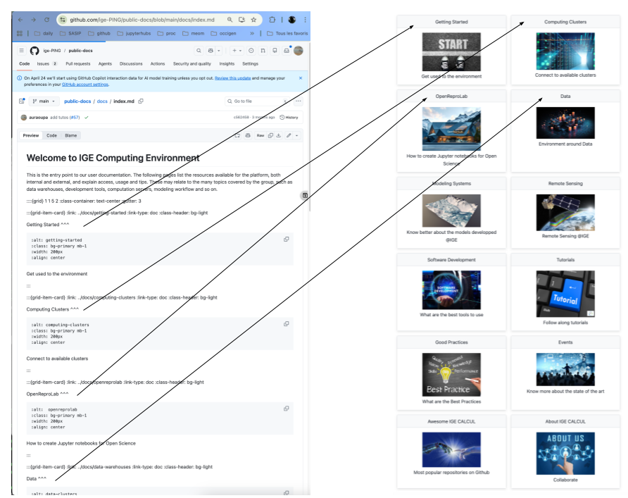
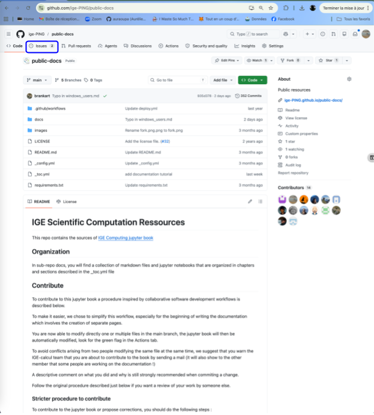
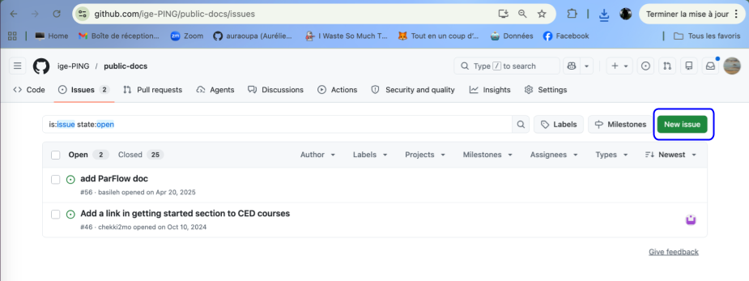
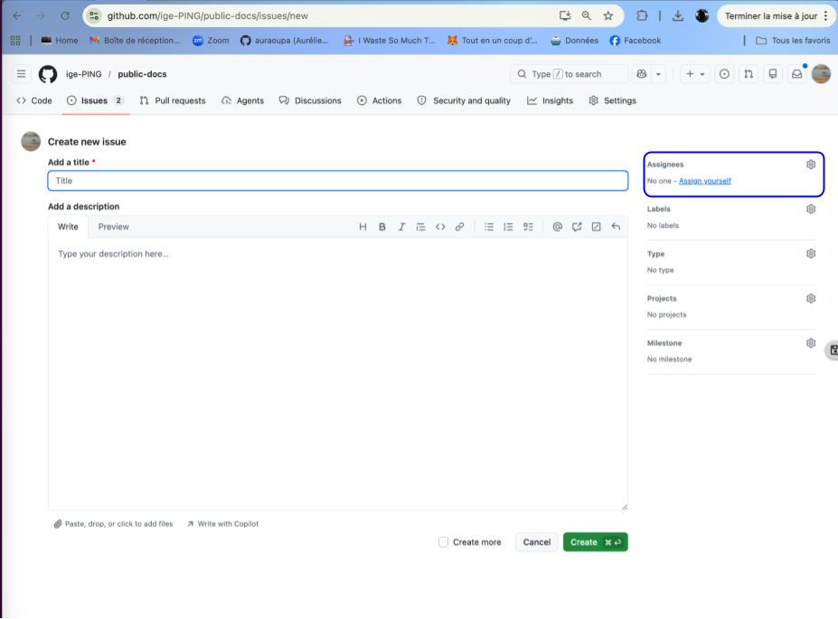

(documentation)=

# Modify this documentation

If you are not yet a contributor to this github repo please ask Aurélie Albert to join by sending her a mail at aurelie.albert at univ-grenoble-alpes.fr or by posting an issue and tagging her at auraoupa.

 - [Architecture of the documentation](https://ige-ping.github.io/public-docs/docs/tutorials/documentation.html#architecture-of-the-documentation)
 - [How to raise an issue](https://ige-ping.github.io/public-docs/docs/tutorials/documentation.html#how-to-raise-an-issue)
 - [How to fix a typo](https://ige-ping.github.io/public-docs/docs/tutorials/documentation.html#how-to-fix-a-typo)
 - [How to add a new page](https://ige-ping.github.io/public-docs/docs/tutorials/documentation.html#how-to-add-a-new-page)

## Architecture of the documentation

The sources of this documentation live at github.com/IGE-ping/public-docs

You can access it directly from the jupyter book by clicking on the github logo in the right upper corner, then Repository

The source for the landing page is located in the docs/index.md file

## How to raise an issue

## How to fix a typo

## How to add a new page