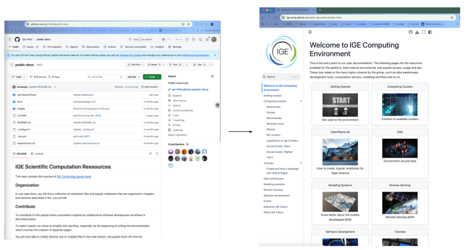

(documentation)=

# Modify this documentation

If you are not yet a contributor to this github repo please ask Aurélie Albert to join by sending her a mail at aurelie.albert at univ-grenoble-alpes.fr or by posting an issue and tagging her at auraoupa.

 - {archi}`Architecture of the documentation`
 - {issue}`How to raise an issue`
 - {typo}`How to fix a typo`
 - {page}`How to add a new page`

(archi)=
## Architecture of the documentation

The sources of this documentation live at github.com/IGE-ping/public-docs

You can access it directly from the jupyter book by clicking on the github logo in the right upper corner, then Repository

(issue)=
## How to raise an issue

(typo)=
## How to fix a typo

(page)=
## How to add a new page